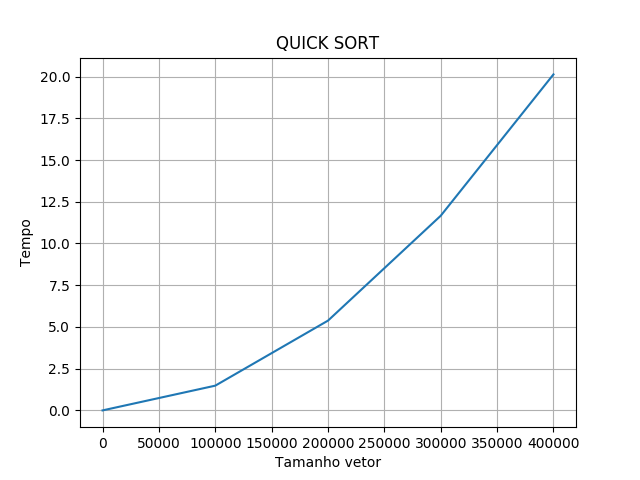

# QuickSort-EDA2

<h4>Algoritmo criado para um exercicio pratico da disciplina Estrutura de Dados e Algoritmo 2</h4>

Alunos 		| Matricula
---------------	| ------
Andrew Lucas   	| 16/0023921 
Nilo Mendonca 	| 16/0037522

O objetivo do programa e a implementacao do algoritmo de ordenacao QuickSort, que possui complexidade O(n²), verificar sua eficiencia e plotar em um grafico a relacao TAMANHO_VETOR x TEMPO.

<h4>Grafico gerado pelo algoritmo</h4>

#### Para executar

'''
    git clone https://github.com/andrewlucasgs/quickSort-EDA2.git
    cd quickSort-EDA2
    pip install -r requeriments.txt
    python3 quicksort.py
'''
